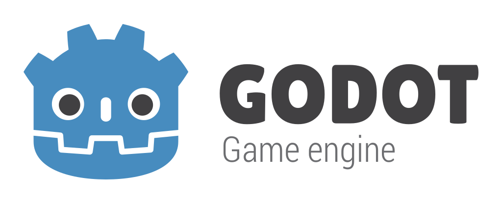

What is Godot?
=====================

.. 
    ---------------------------------------------
    |Substitutions| allow manual HTML insertions
    ---------------------------------------------

.. |demo_video| raw:: HTML

    

        <iframe src="https://www.youtube.com/embed/XptlVErsL-o?mute=1" 
                frameborder="0" 
                allowfullscreen="" 
                style="
                    position: absolute;
                    top: 0;
                    left: 0;
                    width: 100%;
                    height: 100%; "
        ></iframe>
    

    
.. |overview_video| raw:: HTML

    

        <iframe src="https://www.youtube.com/embed/lGZ4RaC4O2w" 
                frameborder="0" 
                allowfullscreen="" 
                style="
                    position: absolute;
                    top: 0;
                    left: 0;
                    width: 100%;
                    height: 100%; "
        ></iframe>
    

    
..
    Comment 
    
    Alt video demo reel 2019: 
        https://www.youtube.com/embed/NlKEO1N8wMM
        
    Aspect-ratio auto-size trick found here:
        https://css-tricks.com/fluid-width-video/#iframe-video-youtube-vimeo-etc

.. |br| raw:: HTML
    
     
    
.. 
    ---------------------------------------------
    </> end of section defining  |Substitutions| 
    ---------------------------------------------

**Godot is...**

* free and open source software ("FOSS").
* used to create both 2D and 3D games.
* an editor (a.k.a "development environment") to arrange and program game assets.
* an great alternative to commercial game creation software.

**Godot is also...**

* a full game engine (which drives games created with the editor).
* elegantly designed, featuring hierarchical organization of nodes.
* cross-platform.
* well-documented.
* currently being ported to run inside web browsers, thanks to a grant from Mozilla.

---------------------------------------------------------------------------------------

Why Godot?
---------------------

While initially designed as a toolkit to design games (combined with an engine
to power finished games once they've left the nest), Godot is an incredibly
powerful and versatile editor to create any software you can imagine.

Godot features modular hierarchical design. First you design a ``scene`` in
isolation, giving it appearance and functionality. Then you can instance that
``scene`` as a sub-component inside other ``scenes`` This workflow is incredible
for constructing and managing complex systems out of many bite-sized
self-contained ``scenes``.

.. hint::
    
    **Godot isn't only for making games.**

    Last year for fun, I wrote a simple text editor in Godot's 2D
    workspace. It was an incredibly fluid experience. Because Godot was
    built as a game development environment, handling keyboard input and working
    with the graphics was incredibly straight-forward.

---------------------------------------------------------------------------------------

Godot 3.0 Release Trailer
--------------------------

|demo_video|

---------------------------------------------------------------------------------------

Official Godot Websites
-----------------------------

=====================      ===============================================
Godot Homepage:            https://godotengine.org/
Godot Documentation:       https://docs.godotengine.org/en/stable/
Godot on YouTube:          https://www.youtube.com/c/GodotEngineOfficial
=====================      ===============================================

---------------------------------------------------------------------------------------

Download Godot Here
-------------------------

=============      ===========================================
Linux:              https://godotengine.org/download/linux
MacOS:              https://godotengine.org/download/osx
Windows:            https://godotengine.org/download/windows
=============      ===========================================

.. note::
    The above links are the official builds, specific to each operating system.

---------------------------------------------------------------------------------------

Build Godot from its Source Code
-----------------------------------

If you'd like to build Godot from its latest source code, check out these links:

=============================   ==========================================================================
Godot's Source Code              https://github.com/godotengine/godot
Godot's Compilation Tutorials   | `https://docs.godotengine.org/en/stable <https://docs.godotengine.org/en/stable/development/compiling/index.html>`_
                                |  `/development/compiling/index.html <https://docs.godotengine.org/en/stable/development/compiling/index.html>`_
=============================   ==========================================================================

.. warning::

   Depending on when (in the development cycle) you fetch and build Godot from the main branch:

   * Typically the code should be stable if a major version is about to come out.
   * Far between releases *(as new features are introduced and debugged
     across different operating systems and computer architectures)*, your build
     might be unstable.

   Either way, it's always fun to see the latest state and direction of
   software. 

.. hint::
       
   If you're more interested in using Godot than contributing to Godot's source
   code, download the current official release from the **Download** section
   above.

---------------------------------------------------------------------------------------

Resources
-----------------

There are treasure troves of great tutorials (both video and text) created on a
regular basis by Godot's incredible community.

Godot's documentation actually has a page dedicated to showcasing
some of the places you can find quality tutorials for Godot: 

* https://docs.godotengine.org/en/latest/community/tutorials.html

On that note, Godot's documentation is an incredibly well-made, and always being
expanded and polished. Here's a great place to start:

* `https://docs.godotengine.org/en/latest <https://docs.godotengine.org/en/latest/getting_started/introduction/introduction_to_godot.html>`_\ |br|\ `/getting_started/introduction/introduction_to_godot.html <https://docs.godotengine.org/en/latest/getting_started/introduction/introduction_to_godot.html>`_

More Intro Info?
-----------------------

If you'd still like to know more, but want to watch videos to get a better
idea, the `YouTube channel GDQuest <https://www.youtube.com/Gdquest>`_ has many
incredible beginner tutorials. 

Here's a great Godot introduction video by GDQuest:

|overview_video|

You can also find more beginner information and tutorials
at `GDQuest.com <https://www.gdquest.com/>`_